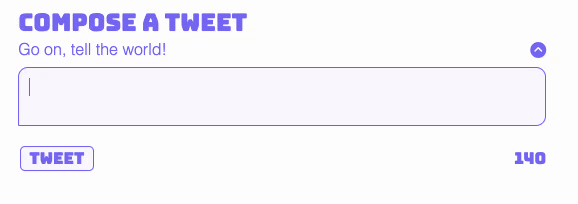
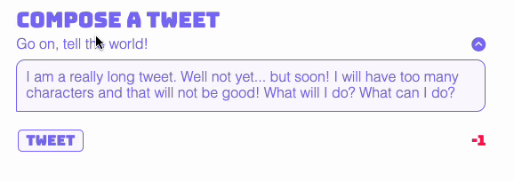
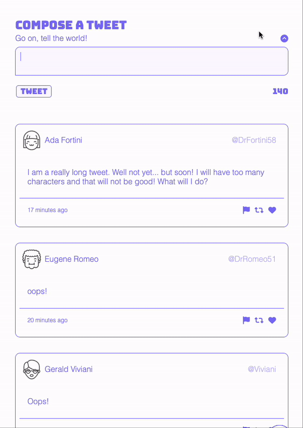
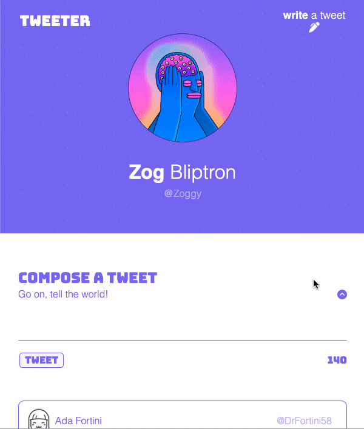

# Tweeter

Tweeter, a straightforward single-page Twitter replica, allows you to enrich your feed by expressing your thoughts. Witness your ideas take form in the digital realm!

*Built within the Web-Flex Sept 18th 2023 program at Lighthouse Labs for educational purposes.*

## Getting Started

1. Clone the repository onto your local device.
2. Install dependencies using the `npm install` command.
3. Start the web server using the `npm run local` command. The app will be served at <http://localhost:8080/>.

## How to use
- Go to <http://localhost:8080/> in your browser.
- Click the "write a tweet" button on the right of the nav to begin writing a new tweet.
- When your tweet is complete, submit it to the simulated ether by pressing the **tweet** button.

## Features
- Responsive Design. Carefully crafted to fit your screen!
- Dynamic ***alerts*** in the new tweet form. 
  - Must contain at least 1 character.
  
  - Must be between 1 - 140 characters.
  
- Collapse your *new tweet form* by pressing the up-arrow button.
  - 
- When scrolling, a *back-to-top* button will appear on the bottom right of the page.
  - 
- Playful pseudo elements tastefully incorporated around the page!

## Dependencies

- Express
- Node 5.10.x or above